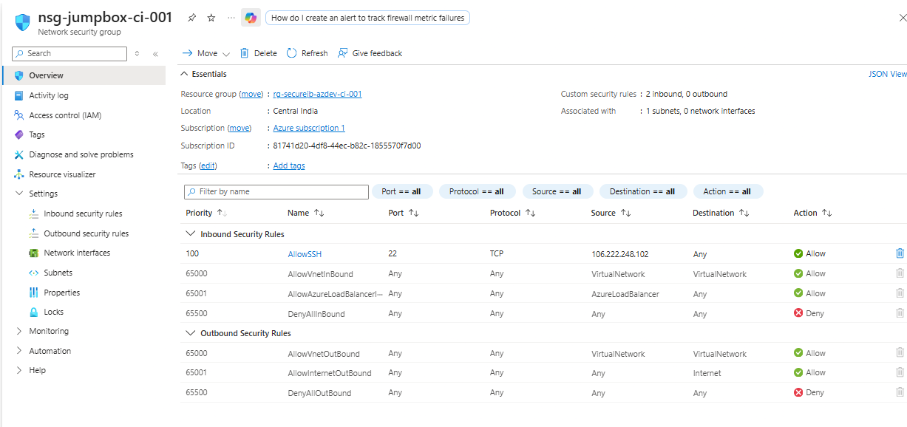
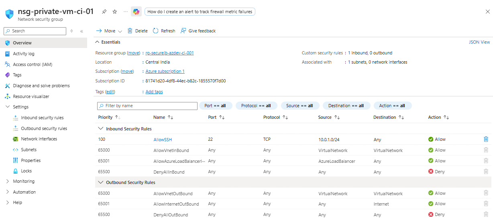
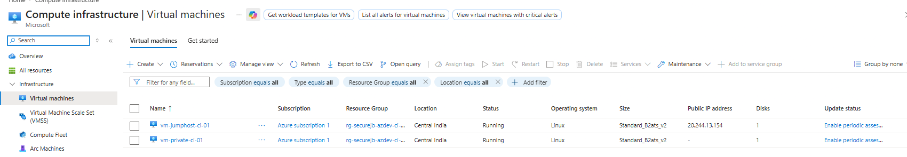
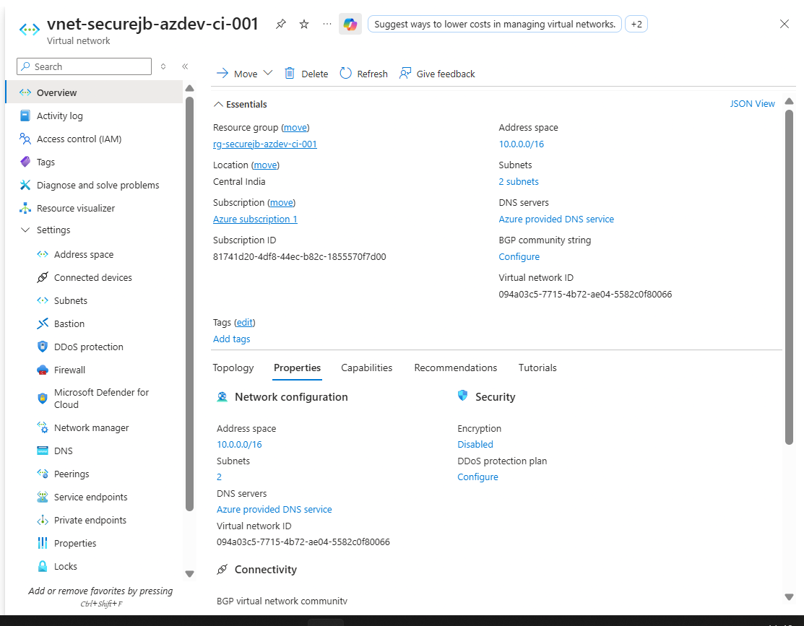

# Secure Private VM Access Architecture in Azure Using Jump Box

## Project Overview

This project demonstrates a secure method of accessing private virtual machines in Microsoft Azure using a Jump Box architecture.

The implementation simulates real-world enterprise cloud security practices where workload virtual machines are deployed inside a private subnet without direct exposure to the public internet.

Administrative access is securely controlled through a dedicated Jump Box VM hosted in a public subnet.

---

# Architecture Diagram


---

# Technologies & Services Used

- Microsoft Azure
- Azure Virtual Network (VNet)
- Azure Virtual Machines
- Network Security Groups (NSGs)
- SSH Authentication
- Ubuntu Linux
- Public & Private Subnets

---

# Architecture Components

| Component | Purpose |
|---|---|
| Resource Group | Logical container for Azure resources |
| Virtual Network (VNet) | Isolated cloud network |
| Public Subnet | Hosts Jump Box VM |
| Private Subnet | Hosts Private VM |
| Jump Box VM | Secure administrative access point |
| Private VM | Internal workload server |
| NSGs | Firewall and traffic filtering |
| SSH | Secure remote connectivity |

---

# Security Implementation

The following security measures were implemented:

- Private VM deployed without Public IP
- SSH access controlled through Jump Box
- NSG rules configured to restrict inbound traffic
- Internal communication performed using private IP addresses
- Subnet isolation used to minimize public exposure

---

# Architecture Flow

```text
User Laptop
     ↓
Jump Box VM (Public IP)
     ↓
Private Linux VM (Private IP)
```

---

# Implementation Steps

## Step 1 — Create Resource Group

Created a dedicated resource group to organize all Azure resources.

### Screenshot


---

## Step 2 — Create Virtual Network & Subnets

Configured:
- Public Subnet
- Private Subnet

### Screenshot


---

## Step 3 — Configure Network Security Groups

Created:
- NSG for Jump Box
- NSG for Private VM

### Screenshots

#### Jump Box NSG



#### Private VM NSG



---

## Step 4 — Deploy Virtual Machines

Deployed:
- Jump Box VM with Public IP
- Private VM without Public IP

### Screenshot



---

## Step 5 — Verify VNet & VM Configuration

Validated:
- Private IP addressing
- Virtual network configuration
- Private subnet placement

### Screenshot



---

## Step 6 — Secure SSH Connectivity

- Connected to Jump Box using SSH
- Accessed Private VM internally using private IP

### Screenshot


---

# Key Learnings

Through this project, I gained hands-on experience with:

- Azure Virtual Networking
- Public vs Private Subnets
- Jump Box Architecture
- SSH-based Secure Access
- Network Security Groups
- Internal VM Communication
- Cloud Security Best Practices
- Secure Administrative Access Design

---

# Future Enhancements

Possible future improvements include:

- Azure Bastion Integration
- VPN-based Secure Access
- Azure AD Authentication
- Multi-Factor Authentication (MFA)
- Just-In-Time (JIT) VM Access
- Azure Monitor & Logging

---

# Conclusion

This project demonstrates a secure and scalable cloud networking architecture for managing private virtual machines in Azure.

The implementation follows cloud security best practices by minimizing public exposure and controlling administrative access through a secure Jump Box architecture.

---

# Author

## Tannu Sharma

Aspiring Cloud & DevOps Engineer

Hands-on learning in:
- Azure Cloud
- Networking
- Cloud Security
- Linux Administration
- Infrastructure & Cloud Projects