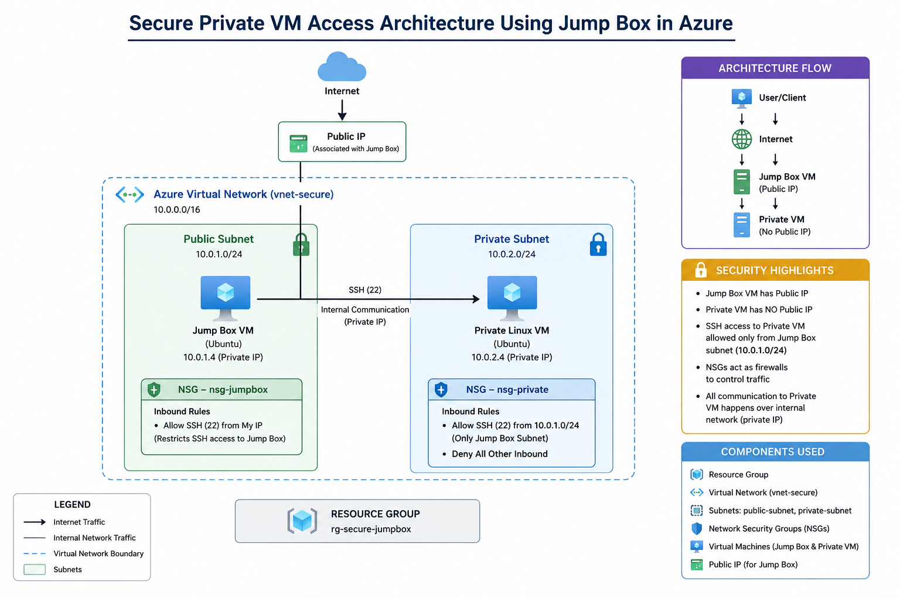
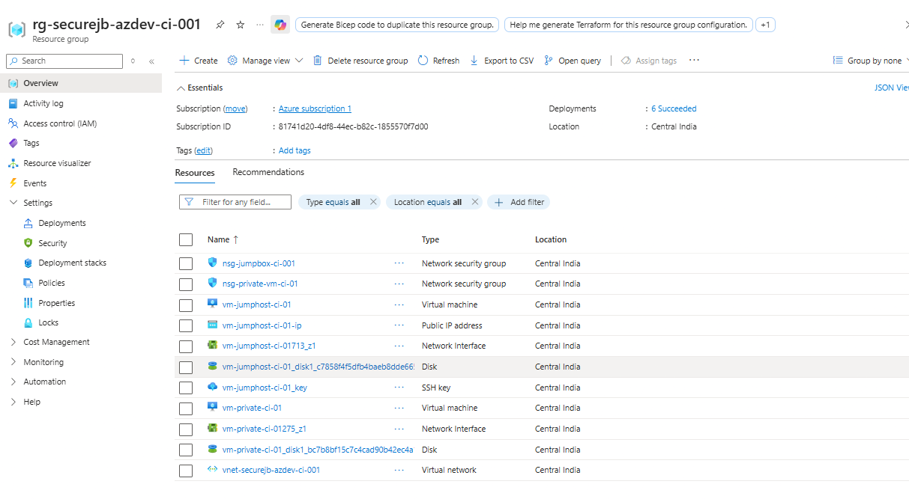
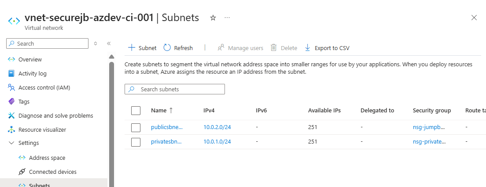
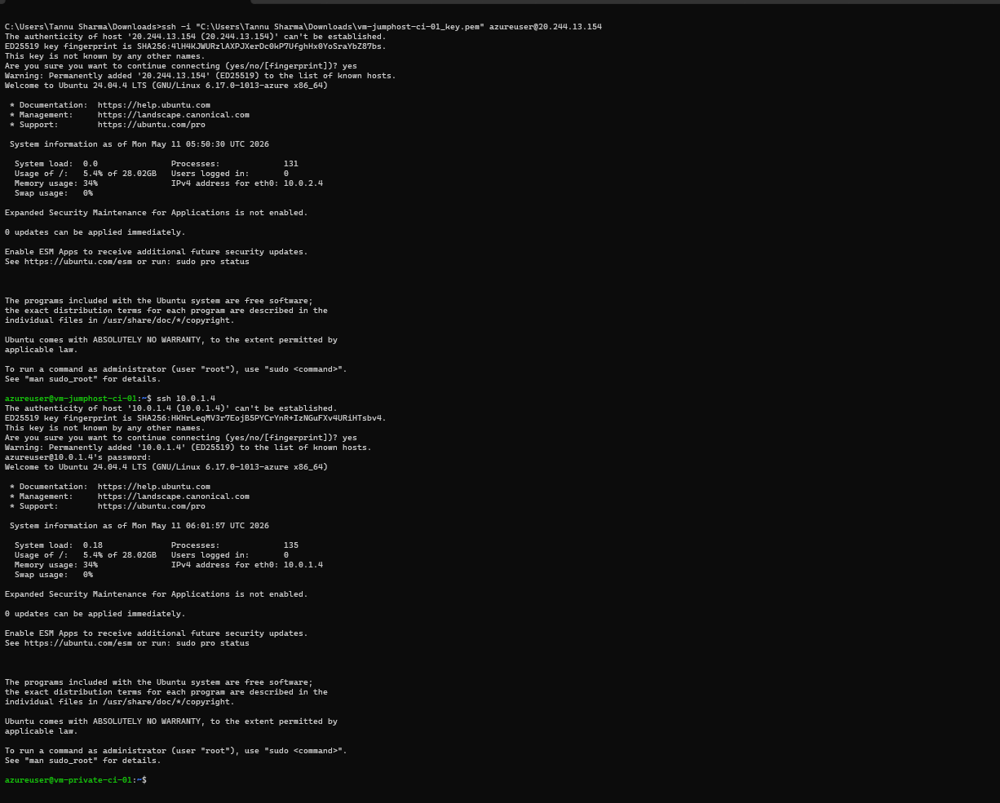

# Secure Private VM Access Architecture in Azure Using Jump Box

## Project Overview

This project demonstrates a secure method of accessing private virtual machines in Microsoft Azure using a Jump Box architecture.

The solution was designed to simulate real-world enterprise cloud security practices where production virtual machines are not directly exposed to the public internet.

Instead of assigning a public IP to the private VM, administrative access is controlled through a dedicated Jump Box VM hosted in a public subnet.

---

# Architecture

## Architecture Diagram



---

# Technologies & Services Used

- Microsoft Azure
- Azure Virtual Network (VNet)
- Azure Virtual Machines
- Network Security Groups (NSGs)
- SSH Authentication
- Ubuntu Linux
- Public & Private Subnets

---

# Architecture Components

| Component | Purpose |
|---|---|
| Resource Group | Logical container for all resources |
| Virtual Network (VNet) | Provides isolated cloud networking |
| Public Subnet | Hosts Jump Box VM |
| Private Subnet | Hosts private VM without public IP |
| Jump Box VM | Secure administrative entry point |
| Private VM | Internal workload VM |
| NSGs | Firewall rules controlling traffic |
| SSH | Secure remote access |

---

# Security Implementation

The following security measures were implemented:

- Private VM deployed without Public IP
- SSH access restricted through Jump Box
- NSG rules configured to limit inbound traffic
- Internal communication performed over private IP addresses
- Public exposure minimized using subnet isolation

---

# Network Flow

```text
User Laptop
     ↓
Jump Box VM (Public IP)
     ↓
Private Linux VM (Private IP)
```

---

# Implementation Steps

## Step 1 — Create Resource Group
Created a dedicated resource group to organize all Azure resources.

Screenshot:



---

## Step 2 — Create Virtual Network & Subnets

Configured:
- Public Subnet
- Private Subnet

Screenshot:



---

## Step 3 — Configure Network Security Groups

Created:
- NSG for Jump Box
- NSG for Private VM

Screenshots:


---

## Step 4 — Deploy Virtual Machines

Deployed:
- Jump Box VM (with Public IP)
- Private VM (without Public IP)

Screenshot:


---

## Step 5 — Secure SSH Connectivity

- Connected to Jump Box using SSH
- Connected to Private VM internally using private IP

Screenshot:



---

# Private VM Verification

The private VM was configured without a public IP address and was accessible only through internal VNet communication.

Screenshot:


---

# Key Learnings

Through this project, I gained hands-on experience with:

- Azure Virtual Networking
- Public vs Private Subnets
- Secure VM Administration
- Jump Box Architecture
- Network Security Groups
- SSH-based Secure Access
- Internal Network Communication
- Cloud Security Best Practices

---

# Future Improvements

Possible future enhancements include:

- Azure Bastion Integration
- VPN-based Secure Access
- Azure AD Authentication
- MFA Integration
- Just-In-Time (JIT) VM Access
- Monitoring & Logging using Azure Monitor

---

# Conclusion

This project successfully demonstrates a secure and scalable cloud networking architecture for managing private virtual machines in Azure.

The implementation follows cloud security best practices by minimizing public exposure and controlling administrative access through a secure Jump Box design pattern.

## Author

Tannu Sharma